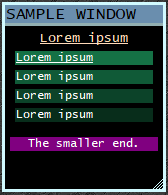
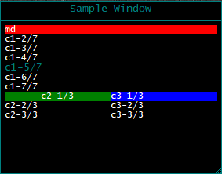
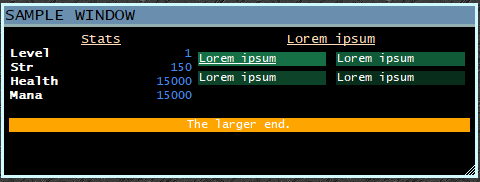
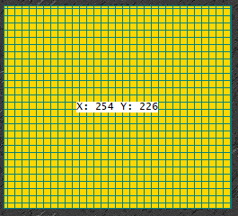

# SimpleWindow
A lua library for creating "responsive" windows in mushclient

*This is still very experimental and I am still really working out I think it should work.*


Sample Pics





Resizing



####
##### Creating the simplest window

Step 1: Somewhere before you want your window to first appear
```lua
local simplewindow = require('simplewindow')

mywindow = simplewindow.CreateWindow()
```


Step 2: Add a view
```lua
  local view =
        mywindow.CreateView {
        Name = 'Main'
    }

  -- You can add/edit any amount of ranges like this
  --   view.Sizes =  {
  --              {Name = 'xs', From = 0},
  --              {Name = 'sm', From = 250},
  --              {Name = 'md', From = 400},
  --              {Name = 'lg', From = 600},
  --              {Name = 'xl', From = 800}
  --         }

    -- OnUpdate will be called after the UpdateInterval has passed or a refresh is being forced
      view.OnUpdate = function(v)
        -- we need a container to put our content in
        local mycontainer =
            v.AddContainer {
            Style = simplewindow.ContainerStyles.RowWrap,
            Sizes = {{Name = 'xs', Percent = '100'}}, -- on this container we want 100% width no matter how wide
            ContentSizes = {
                {Name = 'xs', Percent = '100'},
                {Name = 'sm', Percent = '100'},
                {Name = 'md', Percent = '33'} -- anything medium and up we stick with 33% width
            },
            TextStyle = 'body'
            -- for more on text styles see the configuration section.
        }

        mycontainer.AddContent {
            Text = 'Hola',
            BackColor = 'tan',
            TextStyle = 'title',
            Tooltip = 'Click me',
            Action = function(options)
                print('user clicked ' .. options.Text)
            end
        }
        mycontainer.AddContent {
            Text = 'Hello',
            BackColor = 'red',
            FontColor = 'black',
            Tooltip = 'Hello'
        }
        mycontainer.AddContent {
            Text = 'Aloha',
            BackColor = 23422
        }

        -- add a spacer
        mycontainer.AddContent {
            Text = '',
            Sizes = {{Name = 'xs', Percent = 100}}
        }

        local mySecondContainer =
            v.AddContainer {
            Sizes = {{Name = 'xs', Percent = 0}, {Name = 'sm', Percent = 0}, {Name = 'md', Percent = 30}}, -- hide content it when smaller than medium
            -- right now 0 percent does not save any draw call performance and is just purely math ... todo
            ContentSizes = {{Name = 'xs', Percent = 50}} -- even though xs and sm aren't showing we still just want it at 50% when it is eventually visible
        }

        mySecondContainer.AddContent {
            Text = 'Stats',
            BackColor = 'green',
            Sizes = {{Name = 'xs', Percent = 100}}
        }

        mySecondContainer.AddContent {
            Text = 'Level'
        }
        mySecondContainer.AddContent {
            Text = '1'
        }

        mySecondContainer.AddContent {
            Text = 'Str'
        }
        mySecondContainer.AddContent {
            Text = '150'
        }

        mySecondContainer.AddContent {
            Text = 'Health'
        }

        mySecondContainer.AddContent {
            Text = '15000/15000'
        }

        mySecondContainer.AddContent {
            Text = 'Mana'
        }
        mySecondContainer.AddContent {
            Text = '15000/15000'
        }

        local mythirdContainer =
            v.AddContainer {
            Sizes = {{Name = 'xs', Percent = 100}, {Name = 'sm', Percent = 100}, {Name = 'md', Percent = 70}},
            ContentSizes = {{Name = 'xs', Percent = 100}, {Name = 'sm', Percent = 100}, {Name = 'md', Percent = 50}}
        }

        mythirdContainer.AddContent {}
        mythirdContainer.AddContent {
            BackColor = math.random(ColourNameToRGB('white'), ColourNameToRGB('black'))
        }
        mythirdContainer.AddContent {
            BackColor = math.random(ColourNameToRGB('white'), ColourNameToRGB('black'))
        }
        mythirdContainer.AddContent {
            BackColor = math.random(ColourNameToRGB('white'), ColourNameToRGB('black'))
        }
        mythirdContainer.AddContent {
            BackColor = math.random(ColourNameToRGB('white'), ColourNameToRGB('black'))
        }
        mythirdContainer.AddContent {}

        local myFourthContainer =
            v.AddContainer {
            Sizes = {{Name = 'xs', Percent = 100}}
        }

        myFourthContainer.AddContent {Text = ''} --spacer line since no real spacing/margin/padding support atm

        myFourthContainer.AddContent {
            Text = 'The larger end.',
            Sizes = {{Name = 'xs', Percent = 0}, {Name = 'sm', Percent = 0}, {Name = 'md', Percent = 100}},
            Alignment = {X = simplewindow.Alignments.Center},
            BackColor = 'orange'
        }

        myFourthContainer.AddContent {
            Text = 'The smaller end.',
            Sizes = {{Name = 'xs', Percent = 100}, {Name = 'sm', Percent = 100}, {Name = 'md', Percent = 0}},
            Alignment = {X = simplewindow.Alignments.Center},
            BackColor = 'purple'
        }
    end


    mywindow.RegisterView(view)
```


Step 3: Enable updating the window
```lua
function OnPluginTick ()
    if (mywindow) then
        mywindow.Tick()
    end
end
```


##### Configuration and Theming

```lua

mywindow = simplewindow.CreateWindow(
    simplewindow.CreateConfig {
        Id = 'hellowindow',
        Title = 'Hello Window {viewname}'
    },
     simplewindow.CreateTheme {
        TextStyles = {
        -- function(name, color, isDefault, fontSize, font, backcolor)
        simplewindow.CreateTextStyle('title', 'teal', false, 10),
        simplewindow.CreateTextStyle('header', 'teal'),
        simplewindow.CreateTextStyle('body', 'white', true)
    })
```


##### Configuration Options
| Param Name     | Description                                                         | DefaultValue |
| -------------- | ------------------------------------------------------------------- | ------------ |
| Id             | A unique id for your window.                                        |
| UpdateInterval | How often should the callback for refreshing data and drawing occur |
| Layer          | The higher the layer the more likely to draw ontop of other windows |
| Title          | Text to display at the top of your window.                          |
| TitleAlignment | simplewindow.Alignments.(Start,Center,End)                          |
| Width          | The default width of the window                                     |
| Height         | The default height of the window                                    |
| Left           | The distance from the left side of the screen                       |
| Top            | The distance from the top of the screen                             |
| AllowResize    | Allow the window to be resized by the user                          |
| SaveState      | Automatically save/load the last size/position the window was in    |
| --             | These settings will be moved to theme soon                          |
| BorderWidth    | How wide of the border pen. Yes it should be in theme but.. not yet |
| BodyPadding    | The content in the view is what distance from the border            |
| TitlePadding   | The title what distance from the borders                            |
| BodyPadding    | The content in the view is what distance from the border            |


##### Theme Options
| Param Name      | Description                                     | DefaultValue |
| --------------- | ----------------------------------------------- | ------------ |
| BackColor       | string or number for window background color    |
| BorderColor     | string or number for window border color        |
| DefaultFont     | Font name to use when nothing has been set      |
| DefaultFontSize | Font size to use when nothing has been set      |
| TextStyles[]    | Name, Color, Default, FontSize, Font, BackColor |


##### Container Options
| Param Name   | Description                                                  | DefaultValue |
| ------------ | ------------------------------------------------------------ | ------------ |
| Name         | a name for the container pretty useless atm except logging   |
| Style        | simplewindow.ContainerStyles. (Column, Row, RowWrap)         |
| Sizes        | specify the sizes for the container at specific width states |
| ContentSizes | default size for content at specific width states            |
| TextStyle    | default textstyle for content                                |

##### Content Options
| Param Name      | Description                                                 | DefaultValue |
| --------------- | ----------------------------------------------------------- | ------------ |
| Id              | unique id for the content, used in callbacks from links etc | Random       |
| Text            | What text is in the content                                 |
| Alignment.(X,Y) | simplewindow.Alignments.(Start,Center,End)                  | Start        |
| TextStyle       |                                                             |
| Sizes           |                                                             |
| BackColor       |                                                             |
| FontColor       |                                                             |
| Action          | Function callback on content click                          |
| Tooltip         | Tooltip for content mouse hover                             |


### Structure
| Object                          | Description                                                                                                                  |
| ------------------------------- | ---------------------------------------------------------------------------------------------------------------------------- |
| Window                          | The parent object                                                                                                            |
| Window.Config                   | The main configuration object                                                                                                |
| Window.Theme                    | Font / color information                                                                                                     |
| Window.View[]                   | An array of views can be added to a window to give the user an option of displaying completely different sets of information |
| Window.View.Container[]         | Each container is a grouping of text                                                                                         |
| Window.View.Container.Content[] | Text                                                                                                                         |


