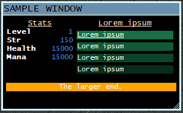

# SimpleWindow
A lua library for creating "responsive" windows in mushclient

*This is still very experimental and I am still really working out I think it should work.*

### Features Completed
- Sizes ranges are customizable
- *Container styles | complete: rowwrap, pending: column, row
- Hide/Show content based on current size
- Grow/Shrink content based on current size
- Padding support (left,top,right,bottom)
- Margin support (left,top,right,bottom)
- Classes (similar functionality to a css class)


Sample Pics





Resizing


####
##### To try it out you can use the SimpleWindowSample.xml plugin.
*It requires the simplewindow.lua to be in your mushclient/lua folder*

#
##### Views
    No ui implemented right now
Essentially the views are just tabs with a different ui for selecting them. The title bar will be right clickable and the user can switch between them via context menu

#

### Sizes
Responsive behaviour is managed via ranges of sizes.


##### Definitions
The sizes are attached to the view instead of the window to allow different layouts
    
At the time of writing this the default size ranges (View.Sizes) were defined as:
```lua
{
    {Name = 'xs', From = 0},
    {Name = 'sm', From = 150},
    {Name = 'md', From = 250},
    {Name = 'lg', From = 400},
    {Name = 'xl', From = 500}
}
-- So if the window width is set (by user or code) to 50 it would match the xs
-- 150-249 match sm and so on. 
```

##### Usage
```lua
statContainer.AddContent {
           Text = 'Stats',
           Sizes = {
                {Name = 'xs', Percent = 100}, 
                {Name = 'md', Percent = 50}, 
                {Name = "xl", Percent = 0}
            }
        }
```
In the scenario above we are saying the content will be 100% of the available width when the window size is currently matched to xs. When the window size reaches sm it will continue to use the xs setting. After reaching md the content will now only use up 50% of the available width allowing for up to 2 of them on the single row (if using rowwrap style). After the window size reaches xl we are just going to completely hide the content.

    
#
### Classes

Classes are the quasi-implementation of css classes we have. They can be mixed and matched and have quite a few properties already implemented with more coming soon.

For all the properties scroll further down to the Class Options

##### Usage
```lua
-- you can apply content classes to an entire container
statContainer.AddContainer {
           ContentClasses = 'name1 name2 name3'
        }

-- or to the content itself which will override anything on the container
-- also if you use spaces in your class names you will want to add them as a table
statContainer.AddContent {
           Text = 'Stats',
           Classes = {'spaced name', 'spaced name2','spaced name3'}
        }
```

##### Builtin Classes
| Class       | Description                                                                      |
| ----------- | -------------------------------------------------------------------------------- |
|             | This blank class is used to supply at least the minimum required items as a base |
| m-sm        | Add a small margin (all sides)                                                   |
| m-md        | Add a medium margin   (all sides)                                                |
| m-lg        | Add a large margin    (all sides)                                                |
| p-sm        | Add a small padding   (all sides)                                                |
| p-md        | Add a medium padding  (all sides)                                                |
| p-lg        | Add a large padding   (all sides)                                                |
| underline   | Underline the text                                                               |
| bold        | Bolden the text                                                                  |
| strike      | strikeout the text                                                               |
| primary     | a primary fontcolor theming (white default)                                      |
| primary-b   | primary color applied to backcolor                                               |
| secondary   | a secondary fontcolor for theming (teal default)                                 |
| secondary-b | secondary color applied to backcolor                                             |
| warning     | sample theming for warning type items (red default)                              |
| warning-b   | warning color applied to backcolor                                               |


#
### Colors

Color properties can be set as a name, decimal, html hex, or rgb table.

```lua
BackColor = 'red'
BackColor = '#FF0000'
BackColor = {255,0,0}

```


###
##### Configuration Options
| Param Name     | Description                                                         | DefaultValue |
| -------------- | ------------------------------------------------------------------- | ------------ |
| Id             | A unique id for your window.                                        | Random       |
| UpdateInterval | How often should the callback for refreshing data and drawing occur | 1 (second)   |
| Layer          | The higher the layer the more likely to draw ontop of other windows | 100          |
| Title          | Text to display at the top of your window.                          |
| Width          | The default width of the window                                     | 300          |
| Height         | The default height of the window                                    | 300          |
| Left           | The distance from the left side of the screen                       |
| Top            | The distance from the top of the screen                             |
| AllowResize    | Allow the window to be resized by the user                          | true         |
| SaveState      | Automatically save/load the last size/position the window was in    | true         |


###
##### Theme Options
| Param Name      | Description                                                                            | DefaultValue   |
| --------------- | -------------------------------------------------------------------------------------- | -------------- |
| DefaultFont     | Font name to use when nothing has been set                                             | Lucida Console |
| DefaultFontSize | Font size to use when nothing has been set                                             | 9              |
| BorderWidth     | How wide is the border on the window                                                   | 3              |
| BorderColor     | Color of window border                                                                 |                |
| TitleClasses    | Names of the classes to apply to the title bar                                         | {'title'}      |
| BodyClasses     | Names of classes to apply to the body. Really just useful for a margin at the moment   | {'body'}       |
| ContentClasses  | Names of the classes to apply by default when nothing is assigned                      | {''}           |
| Classes         | All class definitions. There are some built in definitions that can be used/overriden. |                |

###
##### Class Options
| Param Name | Description                  | DefaultValue |
| ---------- | ---------------------------- | ------------ |
| Name       | Main reference for the class | *required    |
| Font       | Font name                    |
| FontFamily |
| FontSize   |
| Bold       |
| Italic     |
| Underline  |
| Strikeout  |
| Height     | Force a height               |
| BackColor  |
| FontColor  |
| Alignment  |
| Padding    |
| Margin     |

*Right now padding and margin will NOT merge partial settings and you must supply left,top,right,bottom and not just a single one.*

###
##### Container Options
| Param Name     | Description                                                  | DefaultValue |
| -------------- | ------------------------------------------------------------ | ------------ |
| Name           | a name for the container pretty useless atm except logging   |
| Style          | simplewindow.ContainerStyles. (Column, Row, RowWrap)         | RowWrap      |
| Sizes          | specify the sizes for the container at specific width states |
| ContentSizes   | default size for content at specific width states            |
| ContentClasses | default classes for content in container                     |

| Height       | force a height on the container (overflow hidden always atm) |


##### Content Options
| Param Name      | Description                                                                                                                                                            | DefaultValue             |
| --------------- | ---------------------------------------------------------------------------------------------------------------------------------------------------------------------- | ------------------------ |
| Id              | unique id for the content, used in callbacks from links etc                                                                                                            | Random                   |
| Text            | What text is in the content                                                                                                                                            |
| Alignment.(X,Y) | simplewindow.Alignments.(Start,Center,End)                                                                                                                             | Start, Center            |
| Classes         |                                                                                                                                                                        |
| Sizes           |                                                                                                                                                                        |
| BackColor       |                                                                                                                                                                        |
| FontColor       |                                                                                                                                                                        |
| Action          | Function callback on content click                                                                                                                                     |
| Tooltip         | Tooltip for content mouse hover                                                                                                                                        |
| Height          | force a height on the content (overflow hidden always atm)                                                                                                             |
| BackAttached    | Attached the background color to the text and not the content bounds. Basically the backcolor is only behind the text and not the entire bounds the content is allowed | False                    |
| Padding         | (Left,Top,Right,Bottom) padding between content                                                                                                                        | Container.ContentPadding |

### Structure
| Object                          | Description                          |
| ------------------------------- | ------------------------------------ |
| Window                          | The parent object                    |
| Window.Config                   | The main configuration object        |
| Window.Theme                    | Font / color information             |
| Window.View[]                   | Basically tabs without a ui atm      |
| Window.View.Container[]         | Each container is a grouping of text |
| Window.View.Container.Content[] | Text                                 |


